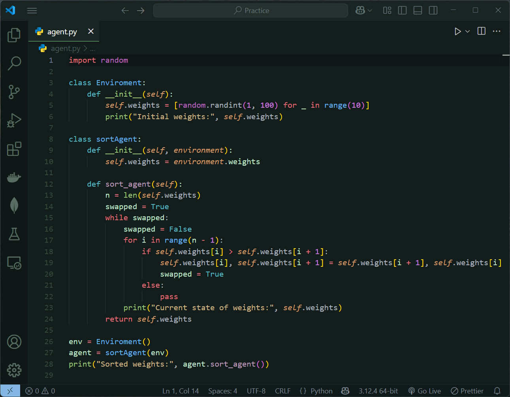

# Aurorain Theme
A dark theme for VS Code.
 
## Theme Preview

  

 

### Installation
1. Open VS Code
2. Go to Extensions (`Ctrl + Shift + X`)
3. Search for "Aurorain"
4. Click "Install"
> **view Marketplace:** [Click here!](https://marketplace.visualstudio.com/items?itemName=MostafaGh.aurorain)

## About!
Aurorain is a carefully crafted dark theme for Visual Studio Code, inspired by the elegance of Aurora lights and the calm of gentle rain.
Whether you're coding late at night or working on complex projects, Aurorain brings clarity and visual harmony to every line of code.

 **Enjoy coding with style!**

  

